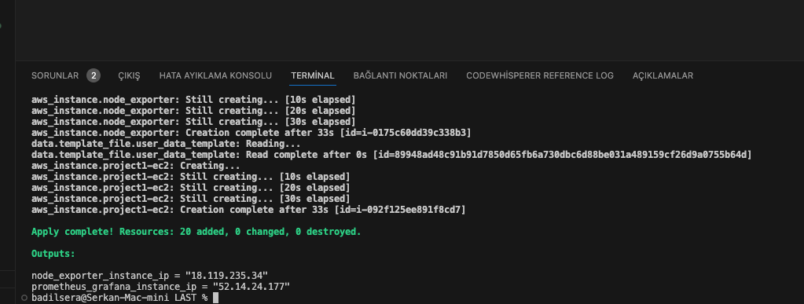
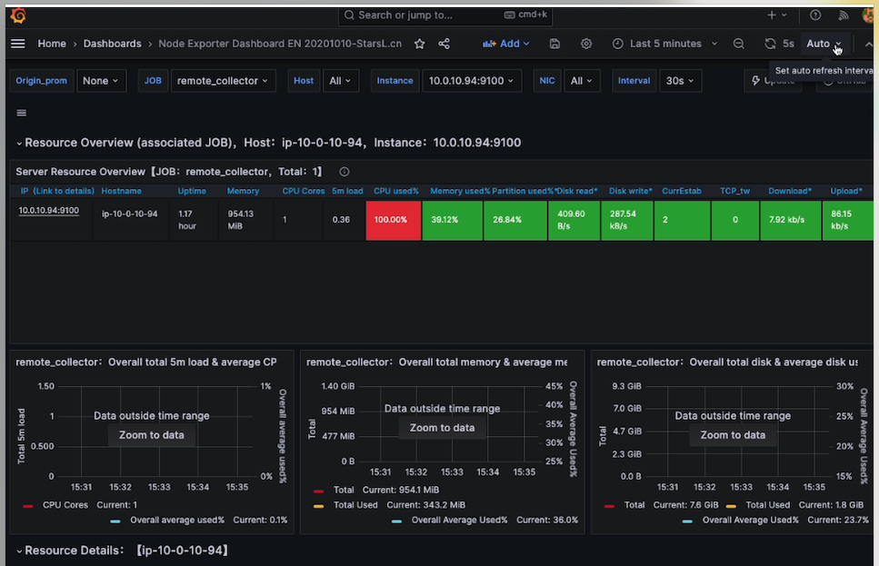

# Project Setup Guide

## STEP 1 - INSTALLATION

1. Download Terraform from [here](https://www.terraform.io/downloads.html).
2. Download AWS CLI if not installed.
3. Create `main.tf` and `terraform` folders in the project directory. You can also install the Terraform plugin for VS Code or another plugin named HashiCorp Terraform.
4. Open the command prompt and run:
   ```shell
   setx AWS_PROFILE user1


This command creates a user named "user1." Configure the user by running:


aws configure --profile "user1"
Enter the user1 information, including region, access key, user key, etc. This information can be found in the AWS account, either in a CSV file or in .aws directory under .config and .credentials. After creating the user (if the AWS account already exists), open .aws/credentials and run aws configure list to display existing users.

The provider block inside main.tf will have minimal configuration. When Terraform is set up this way, it will automatically retrieve relevant information from .aws. There are three ways to define credentials:

Define them using the command line.
Add them to the providers block in main.tf (NOT RECOMMENDED, NOT SECURE).
Add them to the .aws/credentials file. This method is more secure than the second one but involves more effort than the first.
Note: If you remove AWS credentials from the provider block, Terraform will automatically search for saved API credentials (e.g., in ~/.aws/credentials) or IAM instance profile credentials.

STEP 2 - PROJECT SETUP
2.1 Project Folder and Variables
Create a project folder and add a variables.tf file to specify variables for the infrastructure.


variable "name" {
    description = "name of the project"
    type        = string
}
variable "region" {
    description = "aws region"
}
variable "vpc_cidr_block" {
    description = "vpc cidr block"
}
variable "public_subnet_cidr_blocks" {
    description = "CIDR blocks for public subnets"
    type        = map(string)
}
variable "private_subnet_cidr_blocks" {
    description = "CIDR blocks for private subnets"
    type        = map(string)
}
variable "availability_zones" {
    description = "availability zones"
    type        = list(string)
}
variable "security_group_name" {
    description = "security group name"
}
variable "ingress_ports" {
    description = "Ingress ports for security group"
    type        = list(object({
        port        = number
        description = string
    }))
}
variable "ingress_ports_nexp" {
    description = "Ingress ports for security group"
    type        = list(object({
        port        = number
        description = string
    }))
}
// ... (Other variables)
In the same directory, create a terraform.tfvars file and assign values to the variables defined in variables.tf.

name= "project1"
region = "us-east-2"
vpc_cidr_block = "10.0.0.0/16"
// ... (Assign values to other variables)
2.2 Prometheus and Grafana Server User Data
Create a user_data_ps.sh file for Prometheus/Grafana Server:


#!/bin/bash
# ... (Prometheus and Grafana Server setup script)
Create a user_data_nexp.sh file for Node Exporter:


#!/bin/bash
# ... (Node Exporter setup script)
2.3 AWS VPC and Subnets Creation
Define the AWS provider in main.tf:


provider "aws" {
  region = var.region
}
Define network resources, such as VPC, subnets, internet gateway, default route table, NACL, etc., in main.tf.


# VPC definition
resource "aws_vpc" "vpc-project1" {
  cidr_block = var.vpc_cidr_block
  tags = {
    Name = "${var.name}-vpc"
  }
}

# Public Subnets definition
resource "aws_subnet" "public-subnets-project1" {
  # ...
}

# Private Subnets definition
resource "aws_subnet" "private-subnets-project1" {
  # ...
}

# Internet Gateway definition
resource "aws_internet_gateway" "gw-project1" {
  # ...
}

# Default Route Table definition
resource "aws_default_route_table" "main-rtb" {
  # ...
}

# NACL definition
resource "aws_network_acl" "public_nacl" {
  # ...
}

# NACL Association with Subnet
resource "aws_network_acl_association" "public_subnet_nacl" {
  # ...
}

# Route Table Association with Subnet
resource "aws_route_table_association" "public_subnet_association" {
  # ...
}
2.4 EC2 Instances Definition
Define security groups for Prometheus/Grafana and Node Exporter in main.tf.


# Security Group for Prometheus/Grafana
resource "aws_security_group" "sg-project1" {
  # ...
}

# Security Group for Node Exporter
resource "aws_security_group" "sg-project1_nexp" {
  # ...
}
Retrieve Ubuntu AMI information in main.tf:


data "aws_ami" "ubuntu" {
  # ...
}
Define EC2 instances for Node Exporter and Prometheus/Grafana in main.tf.


# Node Exporter Instance
resource "aws_instance" "node_exporter" {
  # ...
}

# Prometheus/Grafana Instance
resource "aws_instance" "project1-ec2" {
  # ...
}
2.5 Outputs
Define outputs to get public IPs of Prometheus/Grafana and Node Exporter in main.tf.


output "prometheus_grafana_ip" {
  # ...
}

output "node_exporter_ip" {
  # ...
}
STEP 3 - TERRAFORM COMMANDS
Initialize the working directory:


terraform init
Create an execution plan:


terraform plan
Apply the changes:


terraform apply
Type yes when prompted.




Destroy the resources when done:


terraform destroy
Type yes when prompted.

STEP 4 - ACCESS INFRASTRUCTURE
Access Prometheus/Grafana:

Open a web browser and enter the following URL:


http://<prometheus_grafana_ip>:3000
Access Node Exporter:

Open a web browser and enter the following URL:


http://<node_exporter_ip>:9100/metrics
That's it! You have successfully set up the infrastructure using Terraform.




This guide assumes that you have some basic knowledge of AWS, Terraform, and Prometheus/Grafana setup. Make sure to customize the configuration files based on your specific requirements. If you encounter any issues, refer to the Terraform documentation or AWS documentation for troubleshooting and additional information.